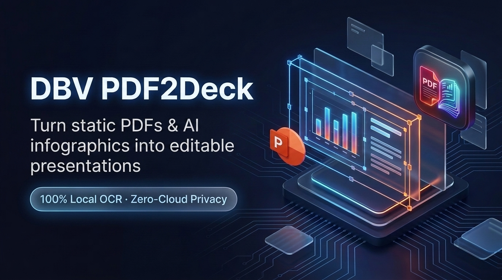
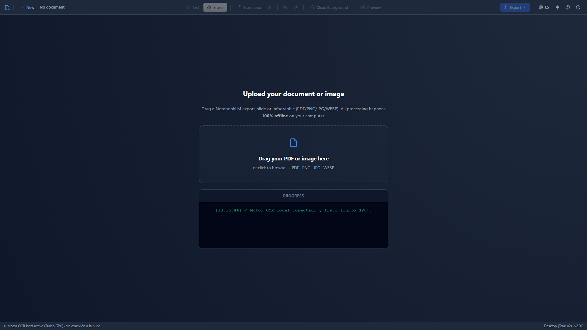
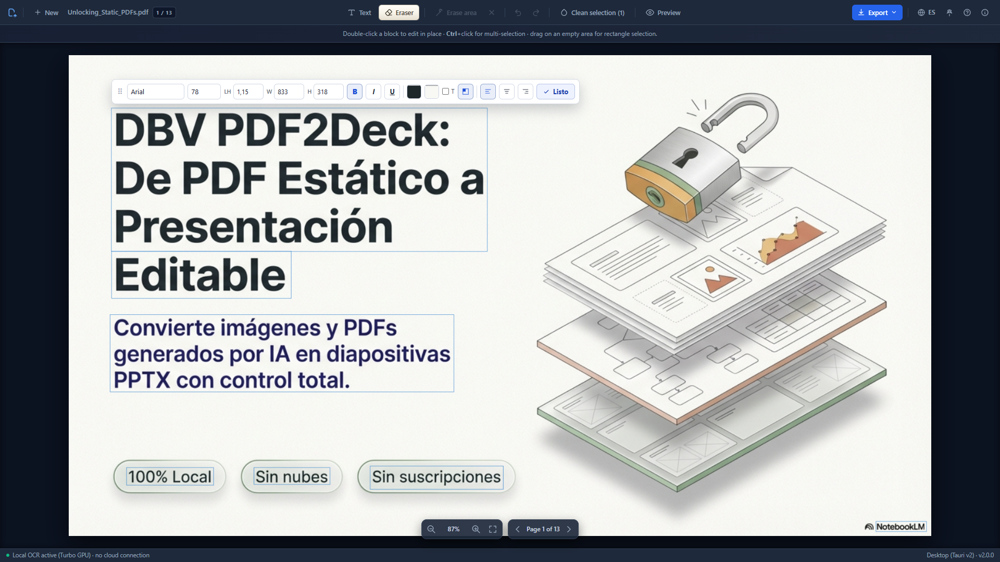
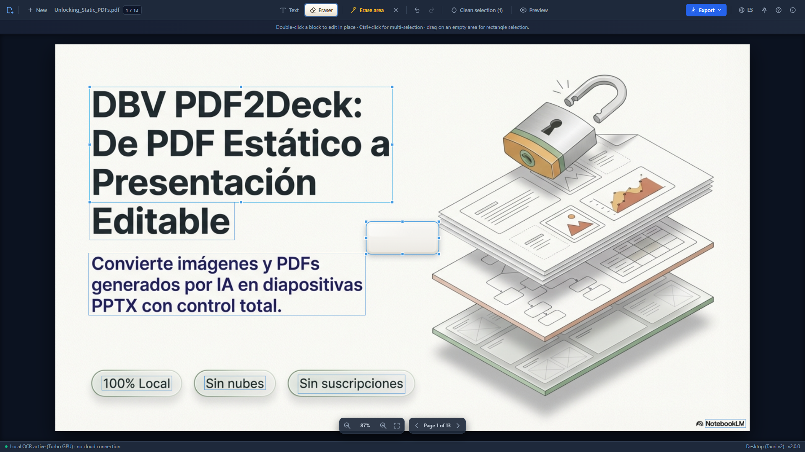
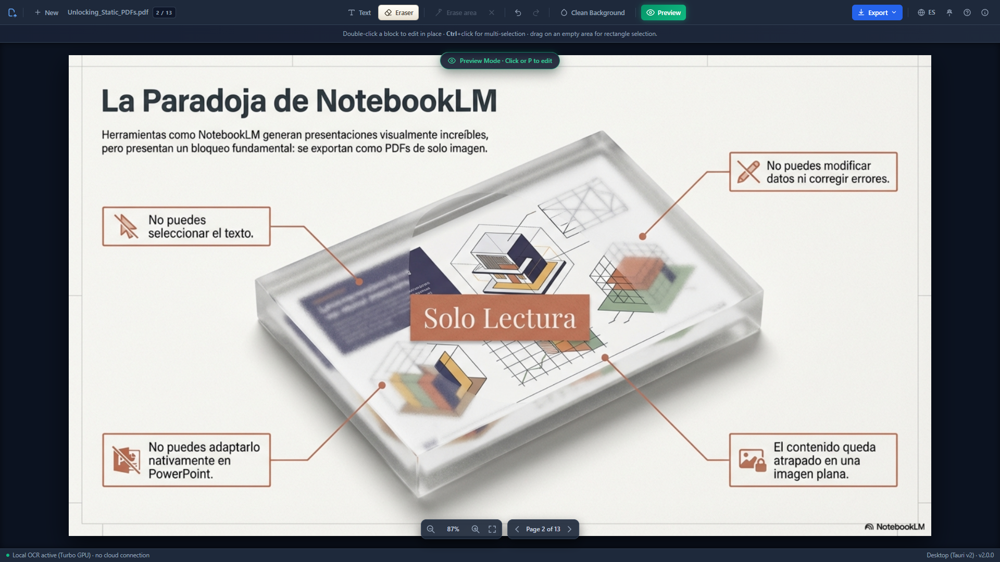

# DBV PDF2Deck 📄➡️📊

**[🇪🇸 Español](./README.md) · 🇬🇧 English**

> **Converts image-only PDFs and AI-generated infographics into fully editable PowerPoint decks using local OCR and a visual canvas.**

> Open Source · 100% Local · No cloud dependencies · GPU acceleration (CUDA)

[](https://python.org)
[](https://fastapi.tiangolo.com)
[](https://tauri.app)
[](https://github.com/JaidedAI/EasyOCR)
[](LICENSE)

<div align="center">
  
</div>

### 📸 Screenshots (Desktop App v2.0.0)

| 1. Welcome & Dropzone | 2. WYSIWYG Visual Editor |
| :---: | :---: |
|  |  |
| **3. Magic Eraser & Inpainting** | **4. Clean Preview Mode & Export** |
|  |  |

---

## 📑 Table of Contents

- [What is DBV PDF2Deck?](#what-is-dbv-pdf2deck)
- [Main use case: NotebookLM presentations](#main-use-case-notebooklm-presentations)
- [Key use case: AI-generated infographics](#key-use-case-ai-generated-infographics)
- [Features](#features)
- [🚀 Desktop Installation (recommended)](#-desktop-installation-recommended)
- [🎬 Official Video Tutorials (YouTube)](#-official-video-tutorials-youtube)
- [Usage](#usage)
- [Tech Stack](#tech-stack)
- [🌐 Web Version Installation (advanced)](#-web-version-installation-advanced)
- [Project Structure](#project-structure)
- [📋 Changelog](#-changelog)
- [Contributing](#contributing)
- [License](#license)
- [Acknowledgments](#acknowledgments)
- [✍️ Authors & Credits](#️-authors--credits)

---

## What is DBV PDF2Deck?

**DBV PDF2Deck** converts image-only PDFs and visual files (like AI-generated infographics) into **fully editable PowerPoint slides**, using local OCR and a visual editor in the browser.

You don't need Adobe Acrobat, and you don't upload your files to any cloud service. Everything happens **on your own computer**.

The flow is simple:
1. **Upload your PDF or image** (`.pdf`, `.png`, `.jpg/.jpeg`, `.webp`) → the system automatically detects whether it has native text or is image-only.
2. **Local OCR analyzes each page** and places editable boxes over the detected text.
3. **Edit the text directly** in the browser with a Canvas-style visual editor.
4. **Export** the result as a PowerPoint presentation (`.pptx`) or a modified PDF.

In practice, this is especially useful for **AI infographics** with common flaws (typos, cut-off text, mixed languages, inconsistent sizes or misaligned titles): you can fix them in minutes and export a professional result.

---

## Main use case: NotebookLM presentations

NotebookLM generates PDF presentations that are **image-only**: you can't select the text, edit it, or convert it directly to PowerPoint. DBV PDF2Deck solves exactly that problem:

```
NotebookLM PDF (image) → Local OCR → Visual Editor → Editable PowerPoint
```

## Key use case: AI-generated infographics

Infographics created by generative models often have visual and text errors: made-up words, misspelled numbers, broken hierarchies or misaligned blocks. DBV PDF2Deck lets you:

1. Load the infographic directly as an image.
2. Detect and edit each text block with precision.
3. Clean the background to remove the original defective text.
4. Export the final result as `.pptx`, `.pdf` or `.md`.

---

## Features

| Feature | Description |
|---|---|
| 🧠 **Local OCR** | Built-in EasyOCR engine (PyTorch). No paid APIs, no internet required. |
| 🖼️ **Flexible input** | Processes multi-page PDFs as well as standalone images (PNG/JPG/WEBP) as an editable single page. |
| ⚡ **GPU acceleration** | CUDA support for NVIDIA cards. OCR drops from ~40s to ~4s per page. |
| 🎨 **Canvas editor** | Visual browser interface. Drag, resize and edit text boxes. |
| 🔍 **Multi-select** | `Ctrl+Click` to select multiple blocks. Match styles or merge them into one. |
| 🗑 **One-click block delete** | Trash icon in the editing toolbar to delete selected blocks with confirmation. |
| ↖️ **Text alignment** | Left / center / right control on each block. Exported to both PDF and PPTX. |
| 🧽 **Hybrid background cleanup** | `Auto / Local (OpenCV) / Cloud (AI Studio)` mode to remove background text. |
| 🖥 **Real progress console** | Live per-page streaming with heartbeat and estimated ETA. |
| 📥 **Multiple export** | Simultaneous download as PowerPoint (.pptx), PDF (vector) and Markdown (.md). |
| ↩️ **Undo / Redo** | 50-state history. Ctrl+Z / Ctrl+Y in the editor. |
| 🔒 **Total privacy** | Documents never leave your machine (except optional, user-initiated AI use). |

---

## 🚀 Desktop Installation (recommended)

**Native desktop application** for Windows, Linux and macOS (Tauri v2, with the OCR engine built in): no Python install, no virtual environment, no console.

> ⚠️ The installer bundles the complete OCR engine (EasyOCR + PyTorch, with optional CUDA GPU acceleration), so it can be several gigabytes — that's the price of keeping all processing 100% local and cloud-free.

### 🪟 Windows

**[⬇️ See all versions (Releases)](https://github.com/davidbuenov/dbv-pdf2deck/releases)**

1. Download the latest installer: `dbv-pdf2deck_x.y.z_x64-setup.exe`.
2. Windows may warn about an "Unknown Publisher" (SmartScreen) since it isn't commercially signed — click **More info → Run anyway**.
3. Follow the installer. Daily use: open **DBV PDF2Deck** from the Start menu.
4. To update, use the **Check for updates** button in the "About" panel — it downloads, installs and restarts for you, without coming back to this page or a browser.

> 🏬 Microsoft Store listing in progress (MSIX packaging). Until then, use the Releases installer.

### 🐧 Linux

**[⬇️ Download the `.deb` or the `.AppImage` from Releases](https://github.com/davidbuenov/dbv-pdf2deck/releases)** — automatically built for every version.

- **`.deb`** (Debian, Ubuntu, Linux Mint and derivatives): `sudo dpkg -i dbv-pdf2deck_x.y.z_amd64.deb` (or double-click it from your file manager).
- **`.AppImage`** (any distribution): make it executable (`chmod +x dbv-pdf2deck_x.y.z_amd64.AppImage`) and run it directly.

### 🍎 macOS

**[⬇️ Download the `.dmg` from Releases](https://github.com/davidbuenov/dbv-pdf2deck/releases)** — automatically built for every version via CI.

It isn't signed or notarized by Apple (the project doesn't use the paid Apple Developer Program), so macOS will block the first launch ("cannot be opened because the developer cannot be verified"). To open it:

- Right-click (or `Ctrl` + click) on `DBV PDF2Deck.app` → **Open** → confirm the dialog. Only needed the first time.
- Or, from Terminal: `xattr -cr "DBV PDF2Deck.app"` before opening it.

> 🟢 Uptodown listing in progress. Until then, download the `.dmg` from Releases.

---

## 🎬 Official Video Tutorials (YouTube)

> 🎞️ Recorded with **version 1.5.0** (web interface) — the upload, OCR and visual-editing flow is the same in the current desktop version, so they're still the best step-by-step reference.

If you prefer to learn by watching the process step by step, there's an official playlist with real demos:

| Type | Content | Link |
|---|---|---|
| Playlist | Official DBV PDF2Deck playlist | [Watch playlist](https://www.youtube.com/playlist?list=PLnNbmcjjevxvysGvmr0qEV505IoHWxo_p) |
| #1 | DBV PDF2Deck: Step-by-step install to edit NotebookLM PDFs | [Watch video](https://www.youtube.com/watch?v=ZCRq3n3ygXw&list=PLnNbmcjjevxvysGvmr0qEV505IoHWxo_p&index=2) |
| #2 | DBV PDF2Deck: Turn NotebookLM PDFs into PowerPoint (Usage Guide) | [Watch video](https://www.youtube.com/watch?v=5ct7S_8XMw0&list=PLnNbmcjjevxvysGvmr0qEV505IoHWxo_p&index=3) |
| #3 | DBV PDF2Deck: Clean complex backgrounds with AI (Gemini) and OpenCV (Local) | [Watch video](https://www.youtube.com/watch?v=3hxGlBWxp2Y&list=PLnNbmcjjevxvysGvmr0qEV505IoHWxo_p&index=4) |
| #4 | DBV PDF2Deck: How to edit and fix text in AI Infographics (Nanobanana example) | [Watch video](https://www.youtube.com/watch?v=vGHM6eGI1VY&list=PLnNbmcjjevxvysGvmr0qEV505IoHWxo_p&index=5) |

---

## Usage

### Real-world use cases in video

If you want to see the actual flow before trying it, these videos (recorded with version 1.5.0) show practical scenarios:

| Practical case | Video |
|---|---|
| DBV PDF2Deck: Turn NotebookLM PDFs into PowerPoint (Usage Guide) | [Watch video](https://www.youtube.com/watch?v=5ct7S_8XMw0&list=PLnNbmcjjevxvysGvmr0qEV505IoHWxo_p&index=3) |
| DBV PDF2Deck: Clean complex backgrounds with AI (Gemini) and OpenCV (Local) | [Watch video](https://www.youtube.com/watch?v=3hxGlBWxp2Y&list=PLnNbmcjjevxvysGvmr0qEV505IoHWxo_p&index=4) |
| DBV PDF2Deck: How to edit and fix text in AI Infographics (Nanobanana example) | [Watch video](https://www.youtube.com/watch?v=vGHM6eGI1VY&list=PLnNbmcjjevxvysGvmr0qEV505IoHWxo_p&index=5) |

### Input limits (non-invasive mode)

To keep the app stable and responsive, the backend applies default limits:

- Maximum file size: **20 MB**
- Maximum rendered image/page side: **8,000 px**
- Maximum total pixels per image/page: **25,000,000 px**

If a file exceeds these limits, it's rejected with a clear error (no automatic downscaling).

You can adjust these values via environment variables:

- `DBV_MAX_UPLOAD_MB` (default `20`)
- `DBV_MAX_IMAGE_SIDE_PX` (default `8000`)
- `DBV_MAX_IMAGE_TOTAL_PIXELS` (default `25000000`)

`.env` support included:

- Copy `.env.example` as `.env`
- You can keep `.env` at the project root or inside `backend/`
- The backend loads both (`backend/.env` and root `.env`) without overwriting variables already set in the system

### Visual Editor

1. **Drag and drop** your PDF or image onto the upload zone (or click to select it).
2. Wait for OCR to process the pages (4–40 seconds depending on GPU/CPU).
3. Click any text box to enter **inline editing** directly on the block.
4. Use the contextual toolbar to change font, size, color, background, transparency, **alignment**, **underline** and **line spacing**.
5. **Ctrl+Click** on several blocks to select them together:
   - **⚖️ Match Styles**: applies the same size, colors and alignment to all of them.
   - **🔗 Merge**: joins the blocks into one (text concatenated with line breaks).
6. You can also select multiple blocks by dragging a rectangle over an empty area of the canvas.
7. Navigate between pages with the pagination controls.

### Export

In the export bar you can check which formats you want to generate (`.pdf`, `.pptx`, `.md`) before downloading.

Click **"📥 Download Selection"** to generate only the checked formats. A `.zip` file will be downloaded with:
- `documento_editado.pptx` — PowerPoint presentation with editable boxes
- `documento_editado.pdf` — PDF with the modified text overlaid
- `documento_editado.md` — Markdown version meant for text reuse, documentation or LLMs

When the original PDF contains hidden hyperlinks, the Markdown export tries to preserve them as `[text](url)`.

### Generative AI & Local Cleanup (Optional)

The **✨ Clean Background** button supports three modes:

- **Auto**: uses Cloud if an API key is present; otherwise, uses Local.
- **Local (OpenCV)**: offline inpainting, no API key required.
- **Cloud (AI Studio)**: generative-AI cleanup (requires an API key).

To use Cloud mode:
1. Get a free API key at [Google AI Studio](https://aistudio.google.com/).
2. Paste it into the **"Google AI Studio API Key"** field in the top bar.
3. Select **Cloud** (or leave **Auto**) and click **"✨ Clean Background"**.

> The API key is stored locally in your browser (`localStorage`). It's never sent to our servers.

> 💡 Quick editing tip: use **Ctrl+Click** across several blocks to activate multi-selection and batch-edit styles.

---

## Tech Stack

### Backend
- **Python 3.12** · FastAPI · Uvicorn
- **EasyOCR + PyTorch** — Local OCR engine (CPU or CUDA GPU)
- **python-pptx** — PowerPoint generation
- **Pillow** — Image processing

### Frontend
- **Vanilla JavaScript** (ES Modules, no frameworks)
- **HTML5 Canvas** — Visual editing engine
- **CSS3 Glassmorphism** — Modern UI with dark mode

### Desktop
- **Tauri v2 (Rust)** — cross-platform native packaging (Windows/Linux/macOS), with the Python backend embedded as a *sidecar*.
- **System WebView** — WebView2 (Windows) / WebKitGTK (Linux) / WKWebView (macOS), instead of bundling a full Chromium.

---

## 🌐 Web Version Installation (advanced)

This path runs the source code directly with Python — intended for development, or if you'd rather not use the desktop installer.

> 🧭 **Not a developer?** Follow the full step-by-step guide:
> - Windows: [Guide for Non-Developers (Windows)](docs/GUIA_NO_INFORMATICOS.md) *(Spanish)*
> - macOS: [Guide for Non-Developers (macOS)](docs/GUIA_MAC_NO_INFORMATICOS.md) *(Spanish)*

### System Requirements

- **Operating system:** Windows 10/11 (64-bit)
- **Python:** 3.12.x (recommended) · [Download](https://www.python.org/downloads/release/python-31210/)
- **Browser:** Modern Chrome, Edge or Firefox
- **GPU (optional):** NVIDIA card with CUDA 12.1 support for acceleration

> ⚠️ **Python 3.13 is not compatible** with PyTorch-CUDA at the moment. Use version 3.12.

### Recommended option (Windows, 1 click)

1. Download or clone the project.
2. Double-click:

```cmd
instalar_y_ejecutar.cmd
```

This script:
- detects Python,
- creates the virtual environment,
- installs dependencies,
- starts the backend and frontend,
- opens the browser.

Daily use afterwards:

```cmd
ejecutar_dbv.cmd
```

To stop services:

```cmd
stop_dev.cmd
```

> Compatibility: you can also keep using `start_dev.bat` and `stop_dev.bat`.

### Manual option (advanced)

### 1. Clone the repository

```bash
git clone https://github.com/davidbuenov/dbv-pdf2deck.git
cd dbv-pdf2deck
```

### 2. Create the virtual environment (Python 3.12)

```cmd
cd backend
py -3.12 -m venv venv
venv\Scripts\activate
```

### 3. Install dependencies

**Option A — CPU only (faster to install, ~200 MB):**
```cmd
pip install -r requirements.txt
```

**Option B — With NVIDIA CUDA GPU acceleration (recommended, ~2.5 GB):**
```cmd
pip install torch torchvision torchaudio --index-url https://download.pytorch.org/whl/cu121
pip install -r requirements.txt
```

> 📖 For more details on GPU installation, see the [CUDA Installation Guide](docs/instalar_cuda.md) *(Spanish)*.

### 4. Verify GPU (optional)

```cmd
python backend/test_cuda.py
```

If you have a properly configured NVIDIA GPU you'll see:
```
¿CUDA Disponible?: SÍ (Modo Turbo Activo)
Nombre de la GPU: NVIDIA GeForce RTX XXXX
```

### 5. Start the system

From the project root:
```cmd
start_dev.cmd
```

This automatically launches two servers:
- **Backend API:** `http://localhost:8000`
- **Web Interface:** `http://localhost:5500`

Open `http://localhost:5500` in your browser and you're done!

### 6. Update (advanced users)

If you already have DBV PDF2Deck installed and want the latest version:

1. Stop services if they're running:

```cmd
stop_dev.cmd
```

2. From the project root, update the code:

```bash
git pull --ff-only
```

3. Update backend dependencies inside the virtual environment:

```cmd
cd backend
venv\Scripts\activate
pip install -r requirements.txt
cd ..
```

4. Start it again:

```cmd
start_dev.cmd
```

If you've made your own local changes and `git pull` fails, save your work (commit or stash) before updating.

---

## Project Structure

```
dbv-pdf2deck/
├── backend/                    # Python/FastAPI server
│   ├── api/
│   │   └── endpoints.py        # REST routes (/process, /export)
│   ├── core/
│   │   ├── ocr_engine.py       # EasyOCR engine + GPU detection
│   │   ├── pdf_renderer.py     # Native block extraction
│   │   ├── exporter_engine.py  # PDF and PPTX export
│   │   └── result.py           # Result pattern (Ok/Err)
│   ├── main.py                 # FastAPI startup + CORS
│   ├── requirements.txt        # Python dependencies
│   └── test_cuda.py            # GPU diagnostics script
├── frontend/                   # Web/Desktop UI (shared)
│   ├── index.html              # Main layout
│   ├── styles.css              # Glassmorphism Dark Mode design
│   ├── canvas_engine.js        # Visual Canvas editing engine
│   ├── desktop_shell.js        # Desktop chrome (Tauri)
│   └── main.js                 # Backend communication
├── src-tauri/                  # Native desktop packaging (Rust/Tauri v2)
│   ├── src/lib.rs              # Python sidecar, macOS native menu, IPC commands
│   └── tauri.conf.json         # App and bundler configuration
├── docs/                       # Public documentation
│   ├── instalar_cuda.md        # GPU installation guide (Spanish)
│   └── STYLEGUIDE.md           # Code style guide
├── .github/workflows/          # CI: release-windows/linux/macos.yml
├── instalar_y_ejecutar.cmd     # One-click installer (Windows, web version)
├── ejecutar_dbv.cmd            # Quick daily startup (web version)
├── start_dev.cmd               # Compatible main entry point
├── stop_dev.cmd                # Stop services
├── start_dev.bat               # Legacy alias -> .cmd
└── stop_dev.bat                # Legacy alias -> .cmd
```

---

## 📋 Changelog

See [CHANGELOG.md](CHANGELOG.md) for the full version history and release notes *(written in Spanish)*.

---

## Contributing

Contributions are welcome. Please:

1. Read the [Code Style Guide](docs/STYLEGUIDE.md) before contributing *(Spanish)*.
2. Make sure your code uses **strict typing** (Python 3.12+) and the **Result pattern** for error handling.
3. Open an Issue before modifying parts of the OCR engine or the exporter.

### Required quality standards
- Python: strong typing with `mypy`, linting with `ruff`
- Backend functions return `Result[T]`, never raise uncontrolled exceptions
- Frontend: vanilla JavaScript with no external frameworks

---

## License

Distributed under the **MIT** license. See [LICENSE](LICENSE) for details.

---

## Acknowledgments

- [EasyOCR](https://github.com/JaidedAI/EasyOCR) — Open-source OCR engine
- [FastAPI](https://fastapi.tiangolo.com/) — Asynchronous web framework
- [python-pptx](https://python-pptx.readthedocs.io/) — PowerPoint generation
- [Tauri](https://tauri.app/) — Cross-platform native desktop app framework

---

## ✍️ Authors & Credits

### 👤 Conceived and directed by

**David Bueno Vallejo**

> *Original idea, product vision, architecture decisions, testing and UX refinement.*

[](https://www.linkedin.com/in/davidbueno/)
[](https://davidbuenov.com)

---

### 🤖 Built with AI Pair Programming

This project was built through an **AI-assisted coding workflow**, where the human author drove architecture and product decisions while AI models generated, debugged and refined the code.

| Tool | Role in the project |
|---|---|
| **[Antigravity](https://antigravity.google)** · *by Google DeepMind* | Main coding agent. Backend, frontend, export engine and overall architecture. |
| **[Gemini](https://gemini.google.com)** · *by Google* | Generative AI engine powering the optional background-cleanup feature, and coding agent for the desktop migration. |
| **[Claude](https://claude.ai)** · *by Anthropic* | Secondary coding agent. Native desktop migration (Tauri v2), GPU setup, debugging and documentation. |
| **GPT Codex** · *by OpenAI* | Pair programming for implementation, refactoring, debugging and closing out version 1.4.0 features. |

> *"The vision was human. The code was a conversation."*
