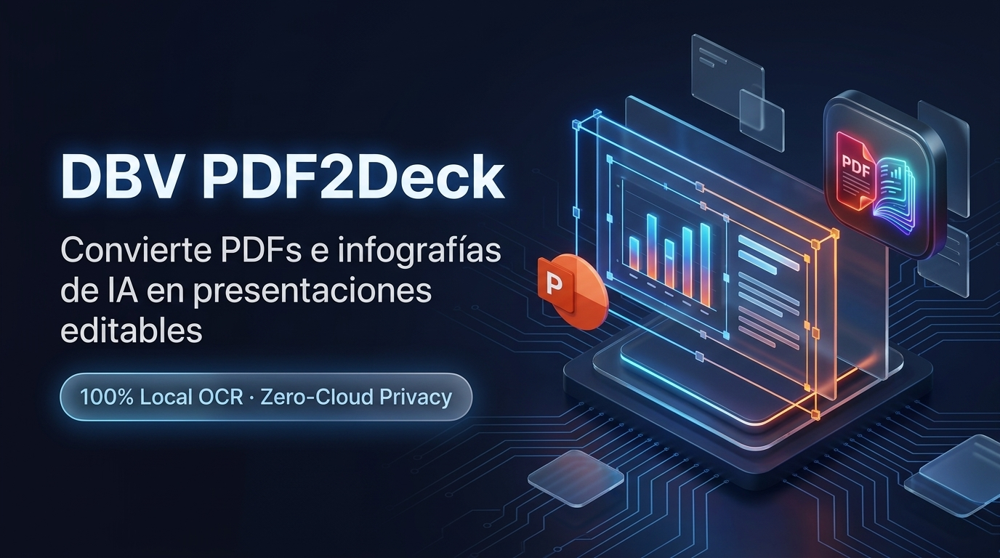
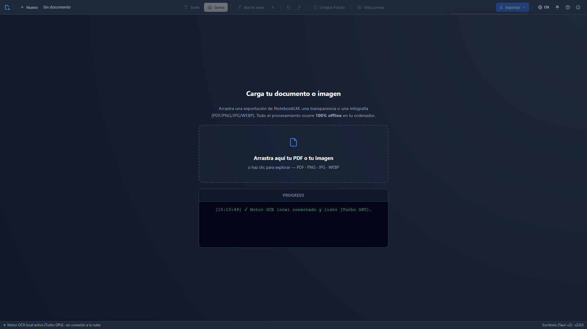
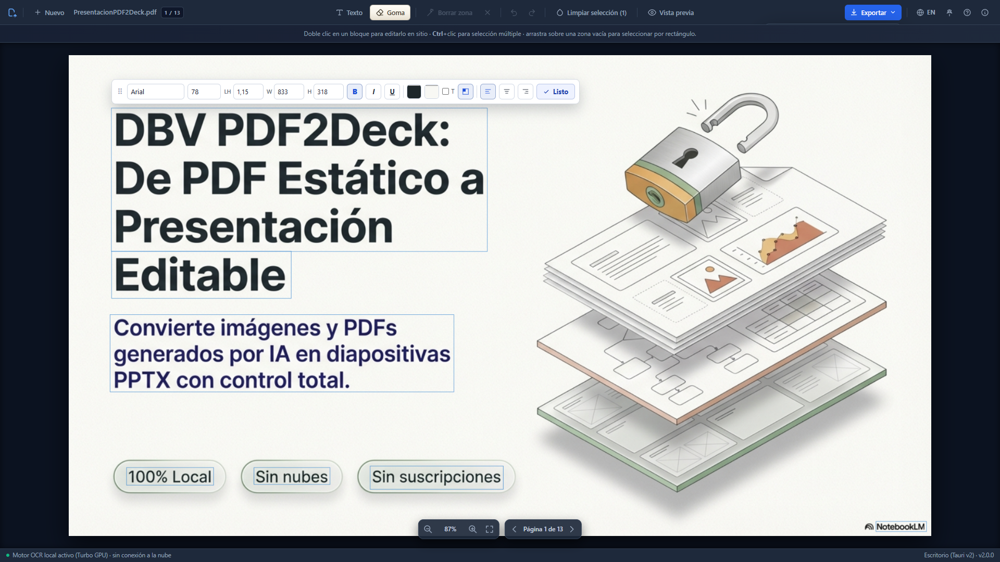
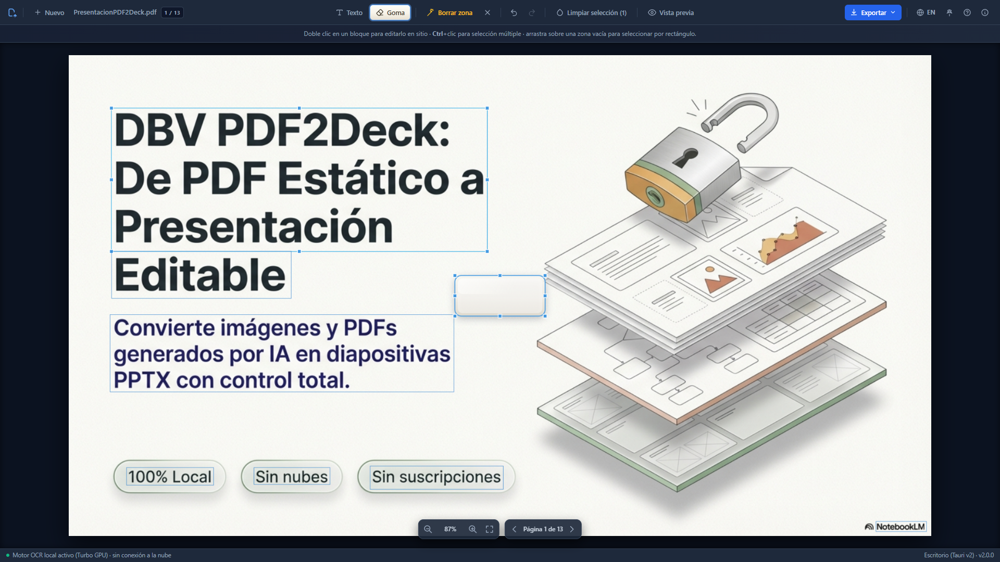
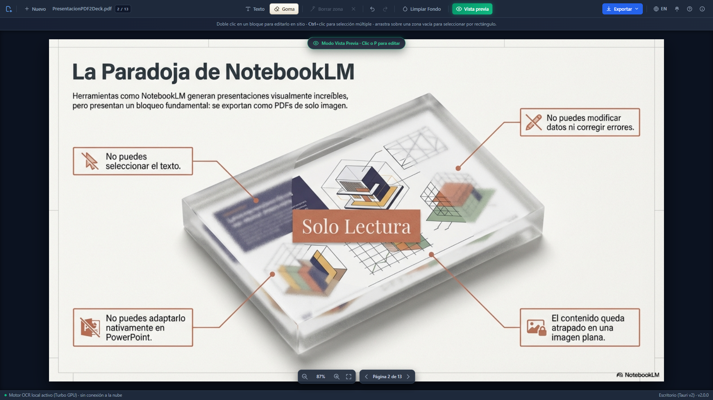

# DBV PDF2Deck 📄➡️📊

**🇪🇸 Español · [🇬🇧 English](./README.en.md)**

> **Convierte PDFs e imágenes (incluidas infografías generadas por IA) en presentaciones de PowerPoint totalmente editables**

> Open Source · 100% Local · Sin dependencias de nube · Aceleración GPU (CUDA)

[](https://python.org)
[](https://fastapi.tiangolo.com)
[](https://tauri.app)
[](https://github.com/JaidedAI/EasyOCR)
[](LICENSE)

<div align="center">
  
</div>

### 📸 Capturas de Pantalla (Desktop App v2.0.0)

| 1. Inicio & Dropzone | 2. Editor Visual WYSIWYG |
| :---: | :---: |
|  |  |
| **3. Goma Mágica & Inpainting** | **4. Vista Previa Limpia & Exportación** |
|  |  |

---

## 📑 Índice

- [¿Qué es DBV PDF2Deck?](#qué-es-dbv-pdf2deck)
- [Caso de uso principal: Presentaciones de NotebookLM](#caso-de-uso-principal-presentaciones-de-notebooklm)
- [Caso de uso clave: infografías generadas por IA](#caso-de-uso-clave-infografías-generadas-por-ia)
- [Características](#características)
- [🚀 Instalación de Escritorio (recomendada)](#-instalación-de-escritorio-recomendada)
- [🎬 Videotutoriales Oficiales (YouTube)](#-videotutoriales-oficiales-youtube)
- [Uso](#uso)
- [Stack Tecnológico](#stack-tecnológico)
- [🌐 Instalación de la Versión Web (avanzada)](#-instalación-de-la-versión-web-avanzada)
- [Estructura del Proyecto](#estructura-del-proyecto)
- [📋 Changelog](#-changelog)
- [Contribuir](#contribuir)
- [Licencia](#licencia)
- [Agradecimientos](#agradecimientos)
- [✍️ Autores y Créditos](#️-autores-y-créditos)

---

## ¿Qué es DBV PDF2Deck?

**DBV PDF2Deck** convierte PDFs de solo imagen y archivos visuales (como infografías generadas por IA) en **diapositivas de PowerPoint totalmente editables**, usando OCR local y un editor visual en el navegador.

No necesitas Adobe Acrobat, ni subir tus archivos a ningún servicio en la nube. Todo ocurre **en tu propio ordenador**.

El flujo es sencillo:
1. **Sube tu PDF o imagen** (`.pdf`, `.png`, `.jpg/.jpeg`, `.webp`) → el sistema detecta automáticamente si tiene texto nativo o solo imagen.
2. **El OCR local analiza cada página** y coloca cajas editables sobre el texto detectado.
3. **Edita el texto directamente** en el navegador con un editor visual tipo Canvas.
4. **Exporta** el resultado como presentación de PowerPoint (`.pptx`) o PDF modificado.

En la práctica, esto es especialmente útil para **infografías de IA** con fallos frecuentes (erratas, textos cortados, mezcla de idiomas, tamaños incoherentes o títulos mal alineados): puedes corregirlos en minutos y exportar un resultado profesional.

---

## Caso de uso principal: Presentaciones de NotebookLM

NotebookLM genera presentaciones en PDF que son **solo imágenes**: no puedes seleccionar el texto, ni editarlo, ni convertirlo directamente a PowerPoint. DBV PDF2Deck resuelve exactamente ese problema:

```
NotebookLM PDF (imagen) → OCR Local → Editor Visual → PowerPoint Editable
```

## Caso de uso clave: infografías generadas por IA

Las infografías creadas por modelos generativos suelen tener errores visuales y de texto: palabras inventadas, números mal escritos, jerarquías rotas o bloques desalineados. DBV PDF2Deck permite:

1. Cargar la infografía directamente como imagen.
2. Detectar y editar cada bloque de texto con precisión.
3. Limpiar el fondo para eliminar texto defectuoso original.
4. Exportar el resultado final en `.pptx`, `.pdf` o `.md`.

---

## Características

| Característica | Descripción |
|---|---|
| 🧠 **OCR local** | Motor EasyOCR (PyTorch) integrado. Sin APIs de pago, sin internet requerido. |
| 🖼️ **Entrada flexible** | Procesa tanto PDF multipágina como imágenes sueltas (PNG/JPG/WEBP) como página única editable. |
| ⚡ **Aceleración GPU** | Soporte CUDA para tarjetas NVIDIA. El OCR pasa de ~40s a ~4s por página. |
| 🎨 **Editor Canvas** | Interfaz visual en el navegador. Arrastra, redimensiona y edita cajas de texto. |
| 🔍 **Multi-selección** | `Ctrl+Click` para seleccionar varios bloques. Igualación de estilos o fusión en uno. |
| 🗑 **Eliminar bloque en 1 clic** | Papelera en la barra de edición para borrar bloques seleccionados con confirmación. |
| ↖️ **Alineación de texto** | Control izquierda / centro / derecha en cada bloque. Se exporta a PDF y PPTX. |
| 🧽 **Limpieza de fondo híbrida** | Modo `Auto / Local (OpenCV) / Cloud (AI Studio)` para eliminar texto de fondo. |
| 🖥 **Consola de progreso real** | Streaming por página en vivo con heartbeat y ETA estimada. |
| 📥 **Exportación múltiple** | Descarga simultánea en PowerPoint (.pptx), PDF (vectorial) y Markdown (.md). |
| ↩️ **Undo / Redo** | Historial de 50 estados. Ctrl+Z / Ctrl+Y en el editor. |
| 🔒 **Privacidad total** | Los documentos nunca salen de tu máquina (salvo uso voluntario de IA). |

---

## 🚀 Instalación de Escritorio (recomendada)

**Aplicación nativa de escritorio** para Windows, Linux y macOS (Tauri v2, con el motor de OCR integrado): sin instalar Python, sin entorno virtual, sin abrir una consola.

> ⚠️ El instalador incluye el motor de OCR completo (EasyOCR + PyTorch, con soporte opcional de aceleración GPU CUDA), así que puede pesar varios gigabytes — es el precio de que todo el procesamiento sea 100% local y sin conexión a la nube.

### 🪟 Windows

**[⬇️ Ver todas las versiones (Releases)](https://github.com/davidbuenov/dbv-pdf2deck/releases)**

1. Descarga el instalador más reciente: `dbv-pdf2deck_x.y.z_x64-setup.exe`.
2. Windows puede avisar de "Editor no reconocido" (SmartScreen) al no llevar firma comercial — pulsa **Más información → Ejecutar de todas formas**.
3. Sigue el asistente de instalación. Uso diario: abre **DBV PDF2Deck** desde el menú de inicio.
4. Para actualizar, usa el botón **Buscar actualizaciones** del panel "Acerca de" — descarga, instala y reinicia por ti, sin volver a esta página ni pasar por el navegador.

> 🏬 Publicación en Microsoft Store en preparación (empaquetado MSIX). Mientras tanto, usa el instalador de Releases.

### 🐧 Linux

**[⬇️ Descarga el `.deb` o el `.AppImage` desde Releases](https://github.com/davidbuenov/dbv-pdf2deck/releases)** — se generan automáticamente en cada versión.

- **`.deb`** (Debian, Ubuntu, Linux Mint y derivadas): `sudo dpkg -i dbv-pdf2deck_x.y.z_amd64.deb` (o doble clic desde el gestor de archivos).
- **`.AppImage`** (cualquier distribución): dale permisos de ejecución (`chmod +x dbv-pdf2deck_x.y.z_amd64.AppImage`) y ejecútalo directamente.

### 🍎 macOS

**[⬇️ Descarga el `.dmg` desde Releases](https://github.com/davidbuenov/dbv-pdf2deck/releases)** — se genera automáticamente en cada versión vía CI.

No está firmado ni notarizado por Apple (el proyecto no usa la cuenta de pago Apple Developer Program), así que macOS bloqueará la primera apertura ("no se puede abrir porque su desarrollador no puede verificarse"). Para abrirlo:

- Clic derecho (o `Ctrl` + clic) sobre `DBV PDF2Deck.app` → **Abrir** → confirmar en el diálogo. Solo hace falta la primera vez.
- O, desde la Terminal: `xattr -cr "DBV PDF2Deck.app"` antes de abrirlo.

> 🟢 Publicación en Uptodown en preparación. Mientras tanto, descarga el `.dmg` desde Releases.

---

## 🎬 Videotutoriales Oficiales (YouTube)

> 🎞️ Grabados con la **versión 1.5.0** (interfaz web) — el flujo de carga, OCR y edición visual es el mismo en la versión de escritorio actual, así que siguen siendo la mejor referencia paso a paso.

Si prefieres aprender viendo el proceso paso a paso, tienes una lista oficial con demostraciones reales:

| Tipo | Contenido | Enlace |
|---|---|---|
| Playlist | Lista oficial de DBV PDF2Deck | [Ver playlist](https://www.youtube.com/playlist?list=PLnNbmcjjevxvysGvmr0qEV505IoHWxo_p) |
| #1 | DBV PDF2Deck: Instalación paso a paso para editar PDFs de NotebookLM | [Ver video](https://www.youtube.com/watch?v=ZCRq3n3ygXw&list=PLnNbmcjjevxvysGvmr0qEV505IoHWxo_p&index=2) |
| #2 | DBV PDF2Deck: Convierte PDFs de NotebookLM en PowerPoint (Guía de Uso) | [Ver video](https://www.youtube.com/watch?v=5ct7S_8XMw0&list=PLnNbmcjjevxvysGvmr0qEV505IoHWxo_p&index=3) |
| #3 | DBV PDF2Deck: Limpia fondos complejos con IA (Gemini) y OpenCV (Local) | [Ver video](https://www.youtube.com/watch?v=3hxGlBWxp2Y&list=PLnNbmcjjevxvysGvmr0qEV505IoHWxo_p&index=4) |
| #4 | DBV PDF2Deck: Cómo editar y corregir texto en Infografías de IA (Ejemplo Nanobanana) | [Ver video](https://www.youtube.com/watch?v=vGHM6eGI1VY&list=PLnNbmcjjevxvysGvmr0qEV505IoHWxo_p&index=5) |

---

## Uso

### Casos de uso en video

Si quieres ver el flujo real antes de probarlo, estos videos (grabados con la versión 1.5.0) muestran escenarios prácticos:

| Caso práctico | Video |
|---|---|
| DBV PDF2Deck: Convierte PDFs de NotebookLM en PowerPoint (Guía de Uso) | [Ver video](https://www.youtube.com/watch?v=5ct7S_8XMw0&list=PLnNbmcjjevxvysGvmr0qEV505IoHWxo_p&index=3) |
| DBV PDF2Deck: Limpia fondos complejos con IA (Gemini) y OpenCV (Local) | [Ver video](https://www.youtube.com/watch?v=3hxGlBWxp2Y&list=PLnNbmcjjevxvysGvmr0qEV505IoHWxo_p&index=4) |
| DBV PDF2Deck: Cómo editar y corregir texto en Infografías de IA (Ejemplo Nanobanana) | [Ver video](https://www.youtube.com/watch?v=vGHM6eGI1VY&list=PLnNbmcjjevxvysGvmr0qEV505IoHWxo_p&index=5) |

### Límites de entrada (modo no invasivo)

Para mantener estabilidad y tiempos de respuesta, el backend aplica límites por defecto:

- Tamaño máximo de archivo: **20 MB**
- Lado máximo de imagen/página renderizada: **8000 px**
- Máximo total de píxeles por imagen/página: **25.000.000 px**

Si un archivo excede estos límites, se rechaza con un error claro (sin reescalado automático).

Puedes ajustar estos valores por variables de entorno:

- `DBV_MAX_UPLOAD_MB` (por defecto `20`)
- `DBV_MAX_IMAGE_SIDE_PX` (por defecto `8000`)
- `DBV_MAX_IMAGE_TOTAL_PIXELS` (por defecto `25000000`)

Soporte `.env` incluido:

- Copia `.env.example` como `.env`
- Puedes guardar `.env` en la raíz del proyecto o dentro de `backend/`
- El backend carga ambos (`backend/.env` y raíz `.env`) sin sobrescribir variables ya definidas en el sistema

### Editor Visual

1. **Arrastra y suelta** tu PDF o imagen en la zona de carga (o haz clic para seleccionarlo).
2. Espera a que el OCR procese las páginas (4–40 segundos según GPU/CPU).
3. Haz clic en cualquier caja de texto para entrar en **edición inline** directamente sobre el bloque.
4. Usa la barra contextual para cambiar fuente, tamaño, color, fondo, transparencia, **alineación**, **subrayado** e **interlineado**.
5. **Ctrl+Click** en varios bloques para seleccionarlos juntos:
   - **⚖️ Igualar Estilos**: aplica el mismo tamaño, colores y alineación a todos.
   - **🔗 Fusionar**: une los bloques en uno solo (texto concatenado con saltos de línea).
6. También puedes seleccionar varios bloques arrastrando un rectángulo en una zona vacía del canvas.
7. Navega entre páginas con los controles de paginación.

### Exportación

En la barra de salida puedes marcar qué formatos quieres generar (`.pdf`, `.pptx`, `.md`) antes de descargar.

Pulsa el botón **"📥 Descargar Selección"** para generar solo los formatos marcados. Se descargará un archivo `.zip` con:
- `documento_editado.pptx` — Presentación de PowerPoint con cajas editables
- `documento_editado.pdf` — PDF con el texto modificado superpuesto
- `documento_editado.md` — Versión Markdown pensada para reutilización textual, documentación o LLMs

Cuando el PDF original contiene hipervínculos ocultos, la exportación Markdown intenta preservarlos en formato `[texto](url)`.

### IA Generativa y Limpieza Local (Opcional)

El botón **✨ Limpiar Fondo** soporta tres modos:

- **Auto**: usa Cloud si hay API key; si no, usa Local.
- **Local (OpenCV)**: inpainting offline, no requiere API key.
- **Cloud (AI Studio)**: limpieza con IA generativa (requiere API key).

Para usar modo Cloud:
1. Obtén una API Key gratuita en [Google AI Studio](https://aistudio.google.com/).
2. Pégala en el campo **"Google AI Studio API Key"** de la barra superior.
3. Selecciona **Cloud** (o deja **Auto**) y pulsa **"✨ Limpiar Fondo"**.

> La API Key se guarda localmente en tu navegador (`localStorage`). Nunca se envía a nuestros servidores.

> 💡 Consejo de edición rápida: usa **Ctrl+Click** sobre varios bloques para activar la multi-selección y editar estilos por lotes.

---

## Stack Tecnológico

### Backend
- **Python 3.12** · FastAPI · Uvicorn
- **EasyOCR + PyTorch** — Motor OCR local (CPU o GPU CUDA)
- **python-pptx** — Generación de PowerPoint
- **Pillow** — Procesamiento de imágenes

### Frontend
- **Vanilla JavaScript** (ES Modules, sin frameworks)
- **HTML5 Canvas** — Motor de edición visual
- **CSS3 Glassmorphism** — Interfaz moderna con dark mode

### Escritorio
- **Tauri v2 (Rust)** — empaquetado nativo multiplataforma (Windows/Linux/macOS), con el backend Python embebido como *sidecar*.
- **WebView del sistema** — WebView2 (Windows) / WebKitGTK (Linux) / WKWebView (macOS), sin empaquetar un Chromium completo.

---

## 🌐 Instalación de la Versión Web (avanzada)

Esta vía ejecuta el código fuente directamente con Python — pensada para desarrollo, o si prefieres no usar el instalador de escritorio.

> 🧭 **¿No eres informático/a?** Sigue la guía completa paso a paso:
> - Windows: [Guía para No Informáticos (Windows)](docs/GUIA_NO_INFORMATICOS.md)
> - macOS: [Guía para No Informáticos (macOS)](docs/GUIA_MAC_NO_INFORMATICOS.md)

### Requisitos del Sistema

- **Sistema operativo:** Windows 10/11 (64-bit)
- **Python:** 3.12.x (recomendado) · [Descargar](https://www.python.org/downloads/release/python-31210/)
- **Navegador:** Chrome, Edge o Firefox moderno
- **GPU (opcional):** Tarjeta NVIDIA con soporte CUDA 12.1 para aceleración

> ⚠️ **Python 3.13 no es compatible** con PyTorch-CUDA actualmente. Usa la versión 3.12.

### Opción recomendada (Windows, 1 clic)

1. Descarga o clona el proyecto.
2. Haz doble clic en:

```cmd
instalar_y_ejecutar.cmd
```

Este script:
- detecta Python,
- crea el entorno virtual,
- instala dependencias,
- arranca backend y frontend,
- abre el navegador.

Uso diario posterior:

```cmd
ejecutar_dbv.cmd
```

Para detener servicios:

```cmd
stop_dev.cmd
```

> Compatibilidad: también puedes seguir usando `start_dev.bat` y `stop_dev.bat`.

### Opción manual (avanzada)

### 1. Clonar el repositorio

```bash
git clone https://github.com/davidbuenov/dbv-pdf2deck.git
cd dbv-pdf2deck
```

### 2. Crear el entorno virtual (Python 3.12)

```cmd
cd backend
py -3.12 -m venv venv
venv\Scripts\activate
```

### 3. Instalar dependencias

**Opción A — Solo CPU (más rápido de instalar, ~200 MB):**
```cmd
pip install -r requirements.txt
```

**Opción B — Con aceleración GPU NVIDIA CUDA (recomendado, ~2.5 GB):**
```cmd
pip install torch torchvision torchaudio --index-url https://download.pytorch.org/whl/cu121
pip install -r requirements.txt
```

> 📖 Para más detalles sobre la instalación de GPU, consulta la [Guía de Instalación CUDA](docs/instalar_cuda.md).

### 4. Verificar GPU (opcional)

```cmd
python backend/test_cuda.py
```

Si tienes GPU NVIDIA correctamente configurada verás:
```
¿CUDA Disponible?: SÍ (Modo Turbo Activo)
Nombre de la GPU: NVIDIA GeForce RTX XXXX
```

### 5. Arrancar el sistema

Desde la raíz del proyecto:
```cmd
start_dev.cmd
```

Esto lanza automáticamente dos servidores:
- **Backend API:** `http://localhost:8000`
- **Interfaz Web:** `http://localhost:5500`

Abre `http://localhost:5500` en tu navegador y ¡listo!

### 6. Actualizar (usuarios expertos)

Si ya tienes DBV PDF2Deck instalado y quieres traer la última versión:

1. Detén servicios si están activos:

```cmd
stop_dev.cmd
```

2. Desde la raíz del proyecto, actualiza el código:

```bash
git pull --ff-only
```

3. Actualiza dependencias del backend en el entorno virtual:

```cmd
cd backend
venv\Scripts\activate
pip install -r requirements.txt
cd ..
```

4. Arranca de nuevo:

```cmd
start_dev.cmd
```

Si has hecho cambios locales propios y `git pull` falla, guarda tu trabajo (commit o stash) antes de actualizar.

---

## Estructura del Proyecto

```
dbv-pdf2deck/
├── backend/                    # Servidor Python/FastAPI
│   ├── api/
│   │   └── endpoints.py        # Rutas REST (/process, /export)
│   ├── core/
│   │   ├── ocr_engine.py       # Motor EasyOCR + detección GPU
│   │   ├── pdf_renderer.py     # Extracción de bloques nativos
│   │   ├── exporter_engine.py  # Exportación PDF y PPTX
│   │   └── result.py           # Patrón Result (Ok/Err)
│   ├── main.py                 # Arranque FastAPI + CORS
│   ├── requirements.txt        # Dependencias Python
│   └── test_cuda.py            # Script de diagnóstico GPU
├── frontend/                   # Interfaz Web/Escritorio (compartida)
│   ├── index.html              # Estructura principal
│   ├── styles.css              # Diseño Glassmorphism Dark Mode
│   ├── canvas_engine.js        # Motor de edición visual Canvas
│   ├── desktop_shell.js        # Chrome de escritorio (Tauri)
│   └── main.js                 # Comunicación con el backend
├── src-tauri/                  # Empaquetado nativo de escritorio (Rust/Tauri v2)
│   ├── src/lib.rs              # Sidecar Python, menú nativo de macOS, comandos IPC
│   └── tauri.conf.json         # Configuración de la app y del bundler
├── docs/                       # Documentación pública
│   ├── instalar_cuda.md        # Guía de instalación GPU
│   └── STYLEGUIDE.md           # Guía de estilo de código
├── .github/workflows/          # CI: release-windows/linux/macos.yml
├── instalar_y_ejecutar.cmd     # Instalador 1 clic (Windows, versión web)
├── ejecutar_dbv.cmd            # Arranque rápido diario (versión web)
├── start_dev.cmd               # Entrada principal compatible
├── stop_dev.cmd                # Detención de servicios
├── start_dev.bat               # Alias legacy -> .cmd
└── stop_dev.bat                # Alias legacy -> .cmd
```

---

## 📋 Changelog

Consulta [CHANGELOG.md](CHANGELOG.md) para ver el historial completo de versiones y novedades.

---

## Contribuir

Las contribuciones son bienvenidas. Por favor:

1. Lee la [Guía de Estilo de Código](docs/STYLEGUIDE.md) antes de contribuir.
2. Asegúrate de que tu código usa **tipado estricto** (Python 3.12+) y el **Patrón Result** para manejo de errores.
3. Abre un Issue antes de modificar partes del motor OCR o del exportador.

### Estándares de calidad exigidos
- Python: Tipado fuerte con `mypy`, linting con `ruff`
- Funciones de backend devuelven `Result[T]`, nunca lanzan excepciones no controladas
- Frontend: JavaScript vanilla sin frameworks externos

---

## Licencia

Distribuido bajo la licencia **MIT**. Ver [LICENSE](LICENSE) para más detalles.

---

## Agradecimientos

- [EasyOCR](https://github.com/JaidedAI/EasyOCR) — Motor OCR open source
- [FastAPI](https://fastapi.tiangolo.com/) — Framework web asíncrono
- [python-pptx](https://python-pptx.readthedocs.io/) — Generación de PowerPoint
- [Tauri](https://tauri.app/) — Framework para aplicaciones de escritorio nativas multiplataforma

---

## ✍️ Autores y Créditos

### 👤 Concebido y dirigido por

**David Bueno Vallejo**

> *Idea original, visión de producto, decisiones de arquitectura, pruebas y refinamiento de UX.*

[](https://www.linkedin.com/in/davidbueno/)
[](https://davidbuenov.com)

---

### 🤖 Desarrollado con Programación en Pareja con IA

Este proyecto fue construido mediante un **flujo de trabajo de codificación asistida por IA**, donde el autor humano dirigió la arquitectura y las decisiones de producto mientras los modelos de IA generaron, depuraron y refinaron el código.

| Herramienta | Rol en el proyecto |
|---|---|
| **[Antigravity](https://antigravity.google)** · *by Google DeepMind* | Agente principal de codificación. Backend, frontend, motor de exportación y arquitectura general. |
| **[Gemini](https://gemini.google.com)** · *by Google* | Motor de IA generativa que impulsa la función opcional de limpieza de fondos, y agente de codificación en la migración a escritorio. |
| **[Claude](https://claude.ai)** · *by Anthropic* | Agente secundario de codificación. Migración a escritorio nativo (Tauri v2), configuración de GPU, depuración y documentación. |
| **GPT Codex** · *by OpenAI* | Programación en pareja para implementación, refactor, depuración y cierre de funcionalidades de la versión 1.4.0. |

> *"La visión fue humana. El código fue una conversación."*
